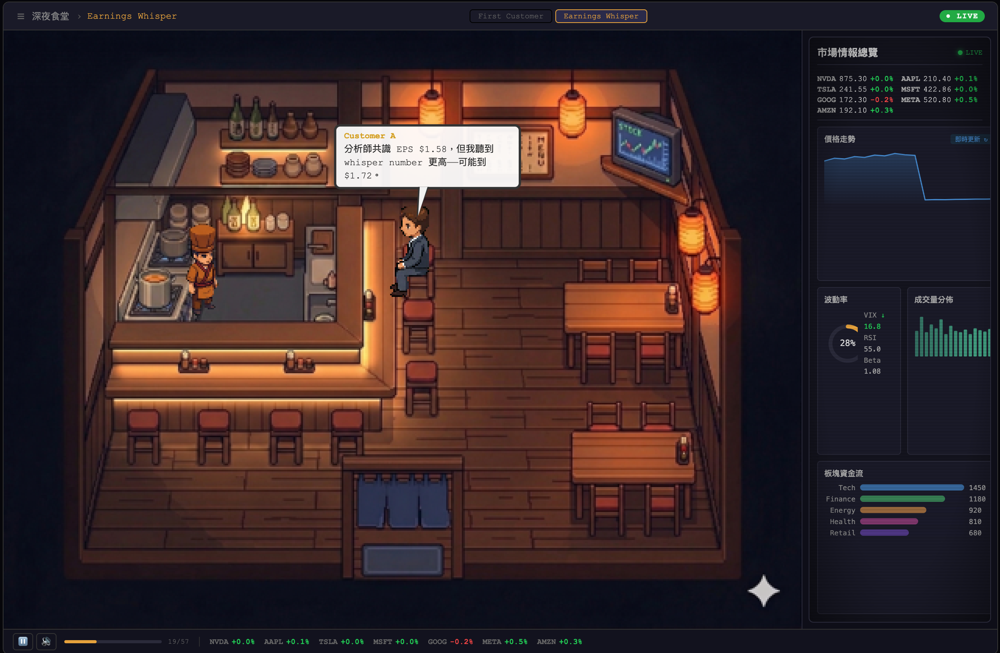

# Midnight Diner x Market Intel

> A pixel-art late-night diner scene combined with real-time market data visualization — an interactive demo project.



## Overview

An interactive pixel-art experience where characters in a cozy late-night diner discuss market events while a live dashboard reacts in real time. The scene is driven by JSON episode scripts, with the architecture designed to seamlessly swap in an LLM API for dynamic content generation.

Built as a portfolio demo to showcase full-stack interactive storytelling, game engine integration, and data visualization skills.

## Live Demo

**[Play it here](https://SIMPLYBOYS.github.io/midnight-diner-market-intel/)**

## Features

- **Pixel Diner Scene** — Hand-crafted 32x32 tile interior with warm late-night lighting and ambient CRT glow
- **Character System** — Sprite sheet animations for walking, sitting, cooking, and emoting
- **Timeline Engine** — JSON-driven episode playback with pause, resume, and restart controls
- **Dialogue System** — Comic-style speech bubbles with typewriter effect
- **Market Intelligence Dashboard** — Live-updating charts, ticker strip, volatility donut, sector flow bars, and breaking news headlines synced to the story
- **CRT Visual Effects** — Scanlines, vignette, and data-flash animations on the dashboard
- **Audio System** — BGM with crossfade transitions and auto-triggered SFX via Howler.js
- **Episode Selector** — Switch between episodes from the top nav; each has its own BGM and market narrative
- **Playback Controls** — Pause/resume/restart, progress bar, and mute toggle

## Tech Stack

| Category | Technology |
|----------|------------|
| Frontend | React + TypeScript |
| Game Engine | Phaser 3 |
| Build Tool | Vite |
| Audio | Howler.js |
| Map Editor | Tiled Map Editor |
| Deployment | GitHub Pages |

## Architecture

```
+------------------------------------------+
|            React UI Layer                |
|  (TopNav / Dashboard / PlaybackBar)      |
+------------------------------------------+
|          TimelinePlayer Engine            |
|   (play / pause / resume / dispatch)     |
+--------------+---------------------------+
|  DataSource  |                           |
|  +--------+  |       Phaser 3 Scene      |
|  |  JSON  |  |  (pixel scene / sprites / |
|  | episodes|  |   lighting / dialogue)   |
|  +--------+  |                           |
|  +--------+  |                           |
|  |LLM API |  |                           |
|  |(future) |  |                           |
|  +--------+  |                           |
+--------------+---------------------------+
```

The **TimelinePlayer** is the core engine that reads JSON episode scripts and drives the scene. The **DataSource** abstraction layer allows swapping JSON scripts for an LLM API without changing game logic.

## Getting Started

```bash
# Prerequisites: Node.js 22+
nvm use  # reads .nvmrc

# Install dependencies
npm install

# Start dev server
npm run dev

# Type check
npm run typecheck

# Build for production
npm run build

# Deploy to GitHub Pages
npm run deploy
```

## Episodes

| Episode | Title | Description |
|---------|-------|-------------|
| EP-01 | First Customer | A quiet evening — the first customer arrives with market gossip about NVDA crashing |
| EP-02 | Earnings Whisper | Two regulars debate an AAPL earnings surprise while the chef serves late-night ramen |

Each episode includes synchronized market data events that update the dashboard in real time as the story unfolds.

## Project Structure

```
src/
  assets/         # Sprites, tilemaps, audio, episode scripts
  audio/          # AudioManager (Howler.js singleton)
  characters/     # Character class and sprite management
  components/     # React components (GameCanvas, overlays)
  datasource/     # DataSource abstraction (JSON / LLM)
  dialogue/       # Dialogue bubble system
  engine/         # TimelinePlayer, EventBus, types
  navigation/     # Pathfinding, walkable grid, locations
  scenes/         # Phaser scenes (Boot, Diner)
  ui/             # React UI (TopNav, MarketDashboard, PlaybackBar)
```

## License

[MIT](LICENSE)
